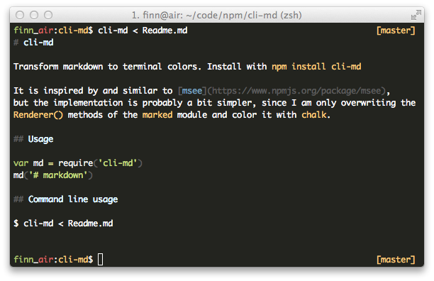

# cli-md
[](https://nodei.co/npm/cli-md/)

Transform markdown to terminal colors. Install with `npm install cli-md`

It is inspired by and similar to [msee](https://www.npmjs.org/package/msee),
but the implementation is using [marked-terminal](https://github.com/mikaelbr/marked-terminal)
as a marked renderer internally.

## Usage
```js
var md = require('cli-md')
md('# markdown')
```

## Command line usage
```
$ cli-md < Readme.md
$ cli-md Readme.md
```
Which would look something like this:

